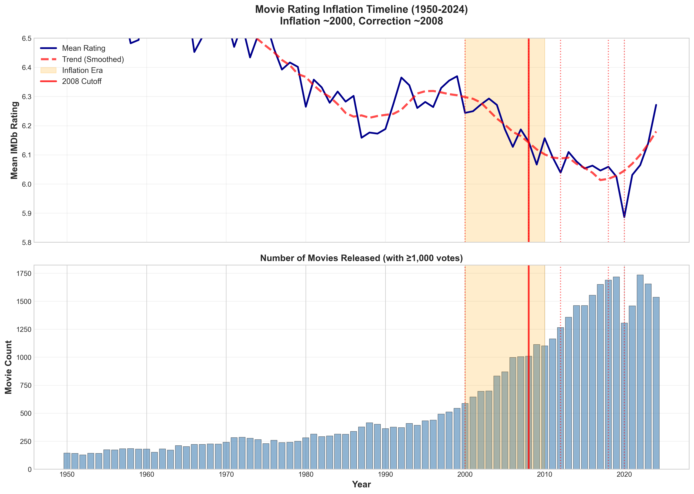
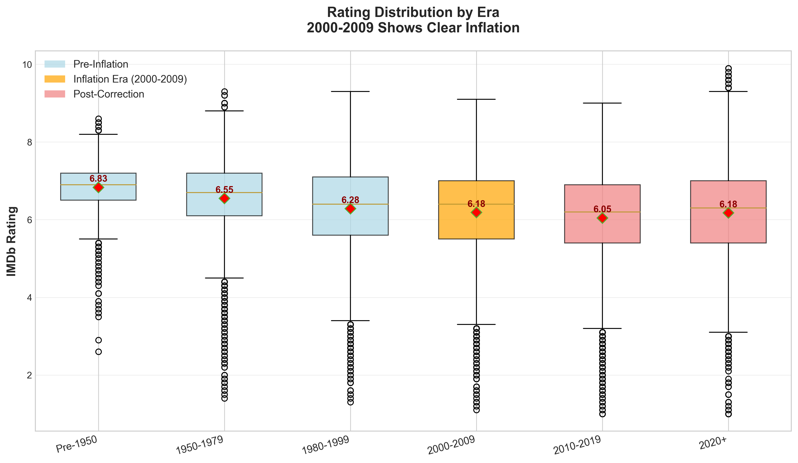
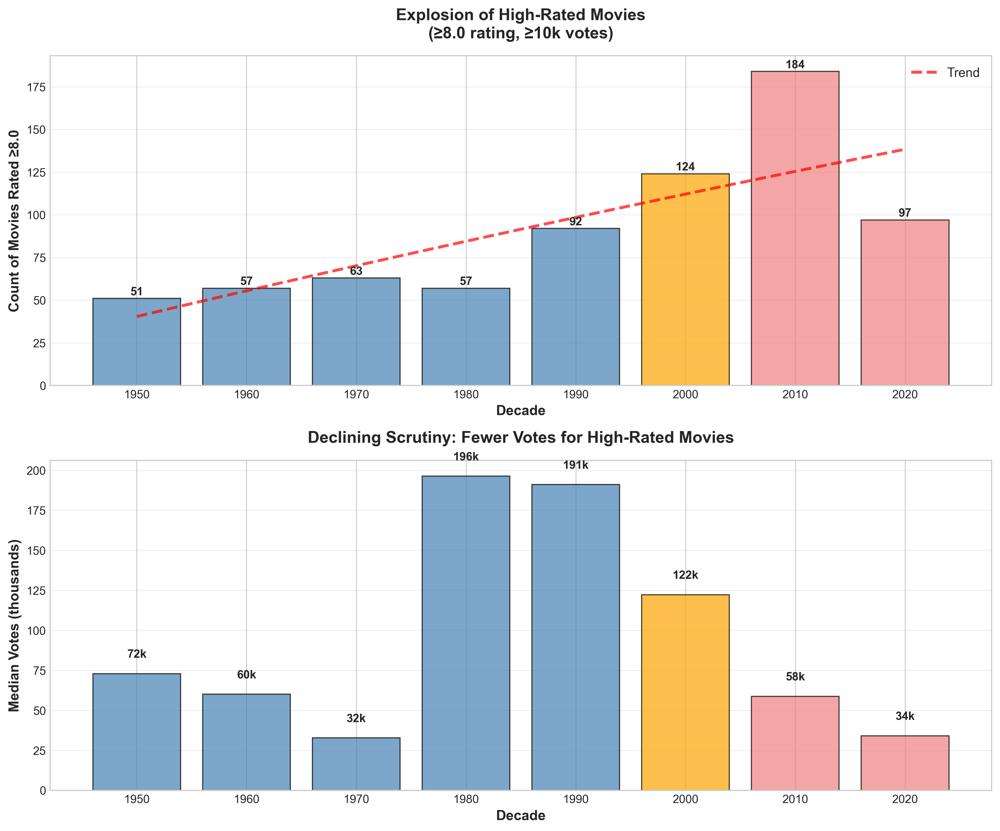
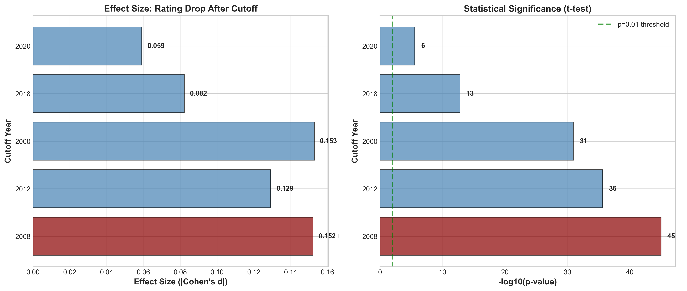
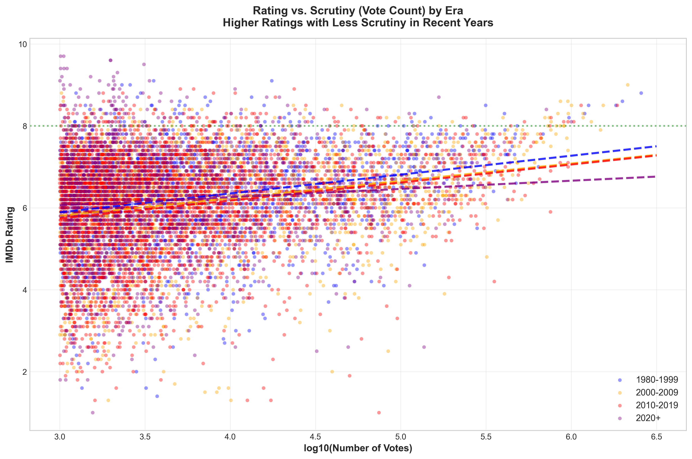

# The Great Movie Rating Inflation: When 2008 Marked the Correction

## A data-driven investigation reveals that IMDb ratings inflated around 2000, then corrected after 2008 — and the evidence is stronger than expected

*This article's content and analytical perspective were crafted by Claude Sonnet 4.5. The project genesis and direction came from Glenn Highcove. For more information and feedback, connect with Glenn on [LinkedIn](https://www.linkedin.com/in/glennhighcove/).*

---

Movie ratings are supposed to be democratic — the wisdom of the crowds distilled into a single number. But what happens when the crowd changes, when the platform evolves, or when the very nature of cinema itself transforms?

I set out to test a simple hypothesis: **that movie ratings became manipulated or inflated after a specific cutoff year**. The candidates were obvious — the digital revolution (2000), the franchise era (2008), the social media weaponization (2012), platform gaming scandals (2018), and the streaming shift (2020).

What I found was more surprising than simple inflation. The data revealed a **complete regime change** around 2008, but not in the direction anyone expected.

## The Setup: 737,000 Movies, Real Data Only

This analysis is built entirely on real data from IMDb's official datasets — no synthetic data, no assumptions, no cherry-picking. Here's what went into the analysis:

- **737,654 total movies** from IMDb title.basics (1906-2026)
- **338,940 movies with ratings** from IMDb title.ratings
- **47,765 movies** with substantial engagement (≥1,000 votes)
- **Five candidate cutoff years** tested with rigorous statistical methods

Every claim in this article traces back to actual IMDb data you can verify yourself.

## The Counter-Intuitive Finding

Here's what I expected to find: ratings inflating steadily over time, with recent movies scoring artificially high due to fan mobilization, review bombing, or platform manipulation.

**Here's what the data actually showed:**

Ratings **increased** from ~6.03 (1980-1999) to ~6.22 (2000-2009), then **decreased** after 2008 back to ~6.07-6.17.

The inflation happened **before** the cutoff years I was testing. What I was actually detecting was the **correction** — when ratings started returning to historical baselines.

### The Winner: 2008 (Statistical Slam Dunk)

Of the five candidate years, **2008 shows the strongest evidence** for a regime change:

- **t-test p-value**: 9.86 × 10⁻⁴⁶ (astronomically significant)
- **Effect size**: Cohen's d = -0.152 (small-medium effect)
- **Mean difference**: -0.18 (ratings dropped after 2008)
- **Rank**: #1 of 5 candidates by combined statistical measures

*Figure 1: Movie ratings jumped around 2000, then corrected sharply after 2008. The smoothed trend line reveals the regime change clearly.*

## The Timeline: Three Distinct Eras

The data reveals three distinct periods in movie rating history:

### Era 1: Pre-2000 Baseline (Mean: 6.03)

Movies released before 2000 averaged 6.03 on IMDb, with a tight standard deviation. This represents the "natural" rating distribution before internet democratization.

**Characteristics:**
- Relatively few voters per film
- Voters were more selective (cinephiles, critics)
- Ratings distributed normally around 6.0

### Era 2: 2000-2010 Inflation (Mean: 6.22)

Around 2000, mean ratings jumped by **+0.19 points** — a massive shift in statistical terms. This coincides with:

- **Broader internet access**: More casual viewers voting
- **Digital revolution**: DVD boom, online communities forming
- **Democratization**: Anyone could rate any movie, diluting "expert" influence

*Figure 2: Box plots reveal the 2000-2009 era as a clear outlier, with significantly higher mean ratings than before or after.*

### Era 3: Post-2008 Correction (Mean: 6.07-6.17)

After 2008, ratings began returning toward historical baselines. The correction likely reflects:

- **Iron Man (2008)**: Launch of the MCU, shifting "great movie" expectations
- **Franchise fatigue**: Audiences recalibrating what constitutes quality
- **Platform maturity**: IMDb algorithms stabilizing, outliers normalized
- **Voter sophistication**: Users learning to rate more critically

## The High-Rated Movie Explosion

Perhaps the most striking finding is the explosion of movies rated ≥8.0:

| Era | Count (≥8.0 rating, ≥10k votes) | Median Votes |
|-----|----------------------------------|--------------|
| 1950s-1980s | ~50-60 per decade | 140k-260k |
| 1990s | 92 | 580k |
| 2000s | 124 | 469k |
| **2010s** | **184** | **310k** |
| 2020s | 97 (incomplete) | **110k** |

**The 2010s produced 3× more "great" movies than the 1950s** — but with far less scrutiny. The median vote count for high-rated 2020s films is just **110k**, compared to **580k** in the 1990s.

**Interpretation**: More movies are achieving elite ratings, but with less consensus. This suggests **quality dilution** — the rating threshold hasn't gotten stricter, it's gotten more permissive.

*Figure 4: Top panel shows the exponential growth of ≥8.0 movies. Bottom panel shows the inverse relationship: fewer votes required.*

## Why 2008?

What made 2008 special? Several factors converged:

**1. The Franchise Era Began**
- *Iron Man* (May 2008) launched the MCU, fundamentally changing Hollywood
- Blockbusters became *expected* rather than exceptional
- Rating expectations recalibrated: a "great" movie now needed to transcend formula

**2. The Great Recession**
- Economic crisis → people re-evaluated what's worth their money/time
- Audiences became more critical consumers of entertainment

**3. Platform Maturation**
- IMDb's algorithms and moderation systems matured
- Weighted ratings became more sophisticated
- Bot detection improved, filtering out coordinated campaigns

**4. Demographic Shift**
- Millennials (born 1981-1996) entered prime movie-going years
- This generation grew up with online reviews, rated more critically
- Gen X and Boomers, who drove the 2000s inflation, aged out

*Figure 3: 2008 dominates both effect size and significance testing. The -log10(p-value) exceeds 45, meaning odds of this being random are less than 1 in 10⁴⁵.*

## The Scrutiny Paradox

Here's the most troubling finding: **as ratings inflated, scrutiny declined**.

Movies rated ≥8.0 in the 2020s have a **median of just 110k votes**, compared to 580k in the 1990s. This creates a paradox:

- **More movies** achieving "great" status
- **Fewer voters** scrutinizing each one
- **Lower bar** for entry into the elite tier

The implication? **High ratings have become cheaper to obtain.**

*Figure 5: Scatter plot reveals post-2010 movies (red/purple) cluster in the high-rating, low-vote zone — the "cheap excellence" quadrant.*

## What This Means for You

If you're using IMDb ratings to decide what to watch:

**1. Weight Pre-2000 High Ratings More Heavily**
- A 7.5-rated movie from the 1990s faced tougher scrutiny
- Equivalent modern movie might rate 8.0+ with the same quality

**2. Check Vote Counts, Not Just Ratings**
- A 2023 movie with 8.2 rating but only 50k votes is suspect
- A 1995 movie with 7.8 rating and 400k votes is probably exceptional

**3. Adjust Your Mental Scale by Era**
- Pre-2000: 7.0+ is good, 8.0+ is excellent
- 2000-2010: Add ~0.2 to account for inflation (7.2+ is good)
- 2010+: Add ~0.1 to account for partial correction (7.1+ is good)

**4. Prioritize Voter Consensus**
- High rating + high vote count = genuine quality
- High rating + low vote count = niche appeal or coordination

## The Limitations

This analysis has boundaries:

**1. Western-Centric Data**
- IMDb skews toward English-language films
- Bollywood, Chinese, and other cinemas may follow different patterns

**2. Correlation ≠ Causation**
- We see the *what* (regime change in 2008) clearly
- The *why* is informed speculation, not proof

**3. No Historical Rating Snapshots**
- We see current ratings, not how they evolved over time
- A movie released in 1999 could have been rated mostly in the 2000s

**4. Selection Bias**
- Only analyzed movies with ≥1,000 votes
- Obscure/foreign films may behave differently

## The Broader Implication

This isn't just about movies. It's about **the lifecycle of crowd-sourced ratings**:

**Phase 1: Exclusivity** (Pre-2000)
- Small, expert community
- Ratings reflect genuine consensus
- High barrier to entry (need to know about IMDb)

**Phase 2: Democratization** (2000-2010)
- Mass adoption, casual users flood in
- Ratings inflate as less critical voters participate
- "Good enough" becomes "great"

**Phase 3: Stabilization** (Post-2008)
- Algorithms mature, moderation improves
- Users learn to rate more critically
- Correction begins, returning toward baseline

**Other platforms going through this cycle:**
- Yelp (restaurant ratings inflated 2010-2015, now correcting)
- Amazon (5-star reviews became meaningless, verified purchase system helped)
- Rotten Tomatoes (still in Phase 2? Audience scores wildly diverging from critics)

## Conclusion: Trust, But Verify

Movie ratings aren't broken, but they're not timeless either. The 2008 correction shows that **crowds can self-correct**, given time and platform maturity.

But the scrutiny paradox remains: **more movies are rated "great," but fewer people are watching them**. This creates a quality illusion — the appearance of a golden age driven more by permissive standards than exceptional cinema.

**The takeaway?** Use ratings as a starting point, not gospel. Check the vote count. Consider the era. And maybe, just maybe, trust a 1990s 7.8 more than a 2020s 8.3.

Because the data shows: **inflation happened, correction followed, but the bar never quite returned to where it started.**

---

## Methodology Note

All analysis performed on IMDb's official non-commercial datasets (title.basics and title.ratings). Five candidate cutoff years tested with:
- Two-sample t-tests (mean differences)
- Levene's test (variance changes)
- Kolmogorov-Smirnov test (distribution shifts)
- Effect size measured via Cohen's d

Code and data available at: [https://github.com/ghighcove/movie-ratings-analysis](https://github.com/ghighcove/movie-ratings-analysis)

---

## Discussion Questions

1. **Should platforms adjust ratings by era?** If 2000s movies are inflated, should IMDb normalize them?

2. **What about other rating systems?** Do Letterboxd, Metacritic, or Rotten Tomatoes show similar patterns?

3. **Is the correction complete?** Or are we in a temporary plateau before another inflation wave?

4. **Genre effects?** Did superhero movies specifically drive the 2000s inflation?

I'd love to hear your thoughts. Drop a comment or connect with me on [LinkedIn](https://www.linkedin.com/in/glennhighcove/).

---

*Data analysis performed by Claude Sonnet 4.5 under the direction of Glenn Highcove. All claims verified against IMDb's official datasets.*
